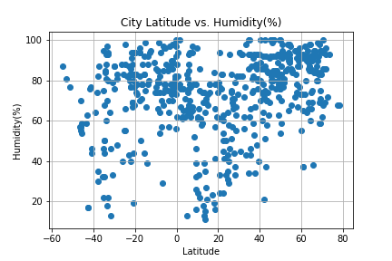
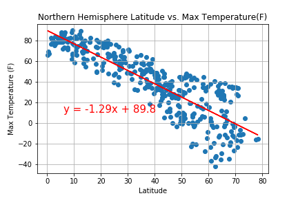

# python-api-challenge-

The OpenWeatherMap API produced series of successive API calls that randomly selected at least 500 unique (non-repeat) cities based on their longitude and latitude. A print log of each city was created as it was being processed with the city number and name. A linear regression was also ran on the Northern Hemisphere (greater than or equal to 0 degrees latitude) and Southern Hemisphere(less than 0 degrees latitude) analysis. A csv was saved of all retreieved data and an image for each scatterplot.

# Identifying Relationships in Comparison to the Latitude:

### Temperature(F) vs. Latitude

Description: This chart shows the citys's latitudes providing a general decreading trend of temperature as the latitude increases.

### Humidity(%) vs. Latitude

Description: This plot shows the latitudes of the following the cities. It's really hard to tell a relationship. For cities with humidities less than 20%, they generally have a smaller latitude.

### Cloudiness(%) vs. Latitude

Description:The following chart shows the Cloudiness(%) over the Latitude coordinates. The values are dispersed and hence it's really hard to detect a fundamental pattern just by looking.

### Wind Speed(mph) vs. Latitude

Description: This plot shows that wind speed is generally less than 20 mph for majority of the cities in correlation to their latitude.

# Northern Hemisphere/Southern Hemisphere (Linear Regression)

### Northern Hemisphere - Max Temperature (F) vs. Latitude

*The r-squared is: -0.8595198424414584*

### Southern Hemisphere - Max Temperature (F) vs. Latitude

*The r-squared is: 0.38018347622141035*

### Northern Hemisphere - Humidity (%) vs. Latitude

*The r-squared is: 0.41738360366121513*

### Southern Hemisphere - Humidity (%) vs. Latitude

*The r-squared is: 0.3497405331439497*

### Northern Hemisphere - Cloudiness (%) vs. Latitude

*The r-squared is: 0.2877268930936464*

### Southern Hemisphere - Cloudiness (%) vs. Latitude

*The r-squared is: 0.44959231626001184*

### Northern Hemisphere - Wind Speed (mph) vs. Latitude

*The r-squared is: 0.006345891408990088*

### Southern Hemisphere - Wind Speed (mph) vs. Latitude

*The r-squared is: -0.22021946026318245*

Three observations based on the Linear Regression:
1) The maximum wind speed of the cities in the Northern Hemisphere is greater than the maximum wind speed in the Southern Hemisphere.
2) There is a higher percentage of cloudiness in the cities in Northern Hemisphere than in the Southern Hemisphere 
3) The max temp has a negative correlation slope in the cities in the Northern Hemisphere while the max temp has a positive correlation slope in the Southern Hemisphere.

